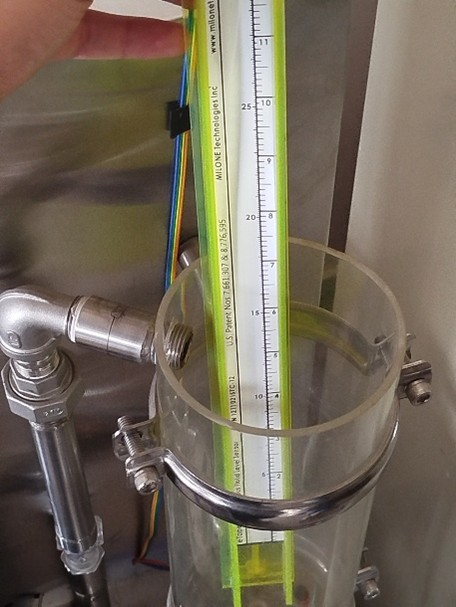
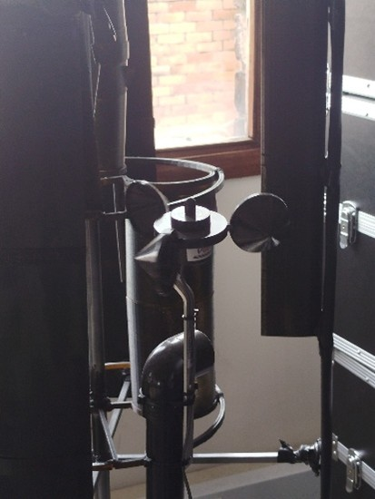

# Sensores Disponibles

---

## 1. 🔧 Dynamixel RX-28  

El **Dynamixel RX-28** es un servo motor inteligente fabricado por **Robotis**, parte de la serie RX.  
Integra sensores internos que permiten control y protección.  

  

**Tabla 1. Sensores internos del Dynamixel RX-28**

| Tipo de sensor       | Qué mide      | Para qué sirve                        |
|----------------------|--------------|---------------------------------------|
| Sensor de posición   | Ángulo       | Control de movimiento                 |
| Sensor de temperatura| Temperatura  | Protección contra sobrecalentamiento  |
| Sensor de voltaje    | Voltaje      | Protección contra bajo voltaje        |

---

## 2. 🌡️ Milone eTape Continuous Fluid Level Sensor  

El **Milone eTape** es un sensor de nivel de fluido que cambia su resistencia según la altura del líquido.  

  

**Tabla 2. Características del Milone eTape**

| Característica       | Valor aproximado |
|----------------------|------------------|
| Rango de medición    | 0 – 35 cm        |
| Salida               | Resistiva        |
| Aplicaciones         | Medición de nivel de agua y líquidos |

---

## 3. 🌬️ Sensor de velocidad de viento RK100-02  

El **RK100-02** es un anemómetro para medir velocidad del viento.  

  

**Tabla 3. Características del RK100-02**

| Característica       | Valor aproximado      |
|----------------------|-----------------------|
| Rango de medición    | 0 – 70 m/s            |
| Precisión            | ± (0.3 + 0.03 V) m/s  |
| Salida               | Voltaje o frecuencia  |
| Aplicaciones         | Meteorología, IoT     |
